<div align="center">

<!-- Animated Header -->


<!-- Animated Typing Effect -->


<!-- GitHub Contribution Snake Animation -->
<!--               -->

</div>

---

## 🚀 About Me


```python
class DataScientist:
    def __init__(self):
        self.name = "Faysal Al Mahmud"
        self.role = "Data Science Student"
        self.location = "Bangladesh 🇧🇩"
        self.current_focus = [
            "📚 Learning Data Science",
            "🐍 Mastering Python",
            "📊 Data Visualization", 
            "🤖 Machine Learning"
        ]
        self.dream = "Solving real-world problems with data"
    
    def say_hi(self):
        print("Thanks for visiting my profile! 👋")

me = DataScientist()
me.say_hi()
```

<br clear="right"/>

---

## 📈 My Learning Journey

<div align="center">

<!-- Animated Progress Bars -->


</div>

<!-- Activity Graph -->
<div align="center">
  
</div>

---

## 🛠️ Tech Arsenal

<div align="center">

### Core Data Science Stack


### Visualization & Analysis  


### Development Tools


### Learning Platforms


</div>

---

## 🔥 Featured Projects

<div align="center">

<a href="https://github.com/faysalalmahmud/bd-healthcare-professional-analysis">
  
</a>

<a href="https://github.com/faysalalmahmud/PaddyGuard">
  
</a>

</div>

---

## 📊 Current Learning Path

<table align="center">
<tr>
<td align="center">

### 📚 **Statistics & Math**
```
✅ Descriptive Statistics
⏳ Inferential Statistics  
📚 Linear Algebra
📚 Calculus
```

</td>
<td align="center">

### 🐍 **Python Ecosystem**
```
✅ Python Fundamentals
✅ Pandas & NumPy
⏳ Data Visualization
📚 Web Scraping
```

</td>
<td align="center">

### 🤖 **Machine Learning**
```
📚 Supervised Learning
📚 Unsupervised Learning
📚 Deep Learning
📚 NLP
```

</td>
</tr>
</table>

---

## 🎯 2025 Roadmap

```mermaid
graph LR
    A[📚 Complete DS Course] --> B[🛠️ Build 5+ Projects]
    B --> C[📜 Get Certified]
    C --> D[💼 Land First Role]
    D --> E[🚀 Data Scientist]
    
    style A fill:#ff9999
    style B fill:#66b3ff
    style C fill:#99ff99
    style D fill:#ffcc99
    style E fill:#ff99cc
```

<div align="center">



</div>

---

## 🌐 Connect With Me

<div align="center">

<!-- Social Media Badges -->
<!--
<a href="mailto:your.email@example.com">
  
</a>
-->
<a href="https://linkedin.com/in/faysalalmahmud">
  
</a>
<a href="https://kaggle.com/faysalalmahmud">
  
</a>
<!--
<a href="https://twitter.com/yourhandle">
  
</a>
-->
<br><br>

<!-- Profile Views Counter -->


</div>

---

<div align="center">

### 💭 *"Data is the new oil, but insights are the refined fuel that powers innovation"*

<!-- Animated Footer -->


</div>
